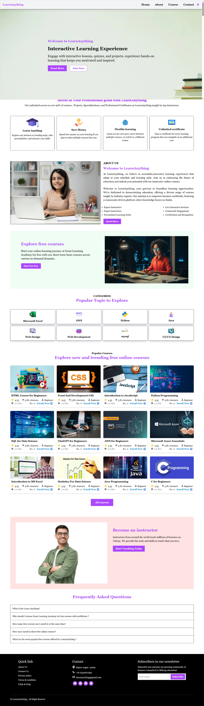
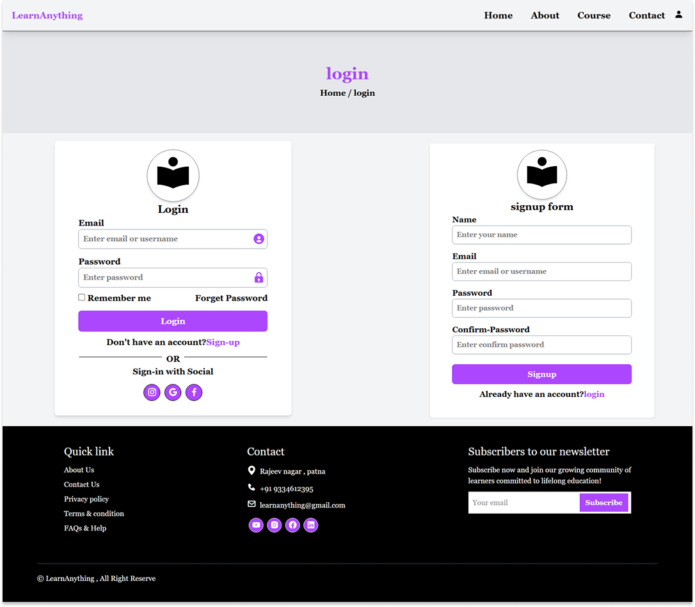

## 📚 E-Learning Website (Front-End)

The **E-Learning Website Front-End** is a responsive and user-friendly interface designed to deliver an engaging online learning experience. It focuses on clean design, smooth navigation, and interactive elements to enhance usability for students and instructors.

### 🚀 Features

* 🎨 Modern and responsive UI design
* 📱 Mobile-friendly layout
* 🎥 Course listing and video preview sections
* 🔍 Search and navigation functionality

## 🔗 Live Demo

👉https://udaybscitstudent.github.io/E_Learning/

---

## 📸 Preview

### 💡 Purpose

The goal of this project is to create an attractive and intuitive user interface for an e-learning platform, ensuring a seamless experience across different devices and screen sizes.

### 🛠️ Technologies Used

* HTML5
* CSS3 (Flexbox, Grid, Animations)
* JavaScript (for interactivity)
* Bootstrap / Tailwind CSS (if used)

### 🎯 Outcome

This project demonstrates front-end development skills by building a visually appealing and responsive e-learning interface that improves user engagement and accessibility.
